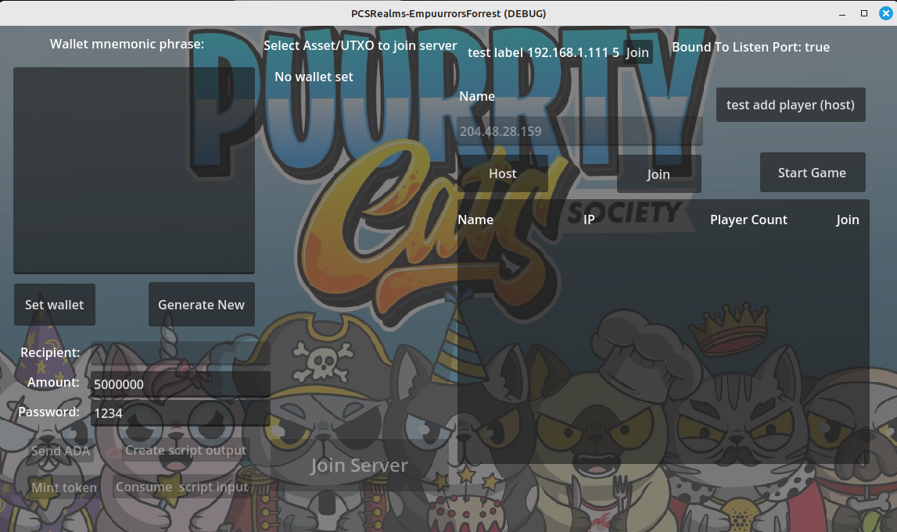
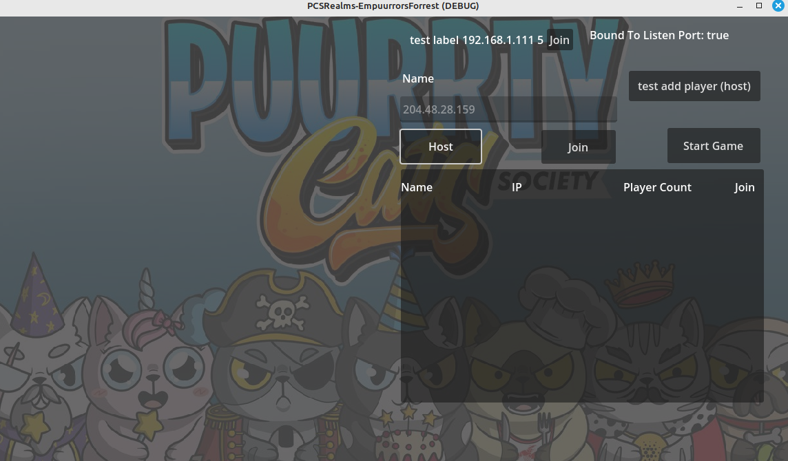
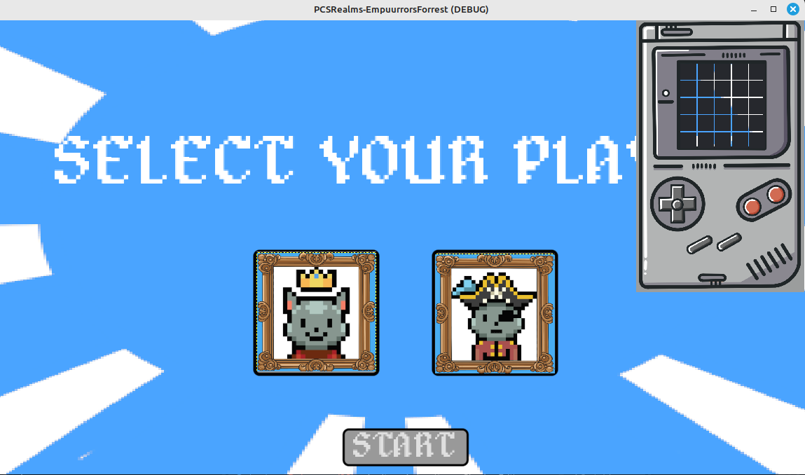
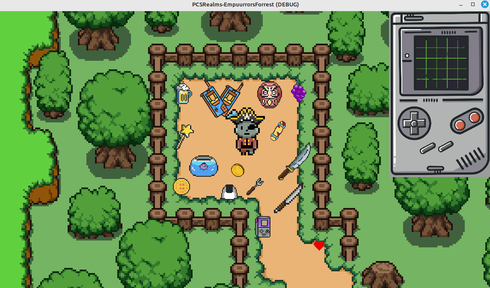

PCS REALMS: The Puurrty Relic Quest

Overview:
-------------
PCS REALMS: The Puurrty Relic Quest is a blockchain-powered, top-down adventure game that merges the timeless lore of pirates with the digital heritage of internet culture. In this immersive experience, players—verified by membership NFTs—assume roles such as King Puurrty, Puurrty Pirate, Navigator, Quartermaster, Relic Seeker, and Scholar. They embark on a journey to preserve culture, collect relics from our OG NFT collection, harvest essential resources, craft legendary items, and engage in community governance. The game’s primary in-game currency is PUURRTY, while XP tokens earned through quests can be redeemed for bonus rewards. 

Profit & Addictiveness Strategy:
-------------
1. **Deep Utility & Scarcity:**
   - **In-Game Economy:** PUURRTY is central—used for trading, crafting, and accessing premium content. Deflationary mechanics like token burning and staking further enhance scarcity, boosting long-term value.
   - **Dual Token System:** XP tokens, earned via challenging relic hunts and lore-rich educational quests, convert into bonus PUURRTY. This reinforces continuous engagement, as players strive to maximize their token rewards.

2. **Engaging Role-Based Experience:**
   - **Exclusive Membership:** Entry is gated by unique membership NFTs that assign roles (e.g., King Puurrty, Puurrty Pirate). These roles unlock tailored quests, enhanced rewards, and governance rights, making every player an integral part of the evolving narrative.
   - **Dynamic Progression:** Role-specific quests, from exploring haunted arcades to harvesting wood from enchanted forests, ensure that each session is packed with discoveries and strategic decisions.

3. **Robust Crafting & Trading Systems:**
   - **Resource Management:** Players gather wood, eggs, relics, and other resources from immersive environments—each element contributing to a vibrant, player-driven economy.
   - **Crafting & Upgrades:** Combine relics with harvested materials to forge powerful items (e.g., the Legendary Meme Engine). This system creates a tangible reward loop that fuels both progression and marketplace trading.
   - **Marketplace Dynamics:** A thriving in-game marketplace allows players to trade resources and crafted items with PUURRTY, driving liquidity and market activity. Rarity and demand spur secondary market royalties, generating ongoing profit.

4. **Cultural Preservation & Governance:**
   - **Lore-Driven Events:** Regular cultural events and educational challenges celebrate pirate heritage and digital legacy, keeping the narrative fresh and the community engaged.
   - **Community Governance:** DAO-based decision-making empowers top-tier players (like King Puurrty and Puurrty Pirate) to influence game updates and economic policies, ensuring that the ecosystem grows organically with its community.

5. **Exchange Exposure & Long-Term Value:**
   - **Exchange Listings:** Strategic listings on decentralized and centralized exchanges maximize PUURRTY’s visibility and trading volume.
   - **Liquidity & Incentives:** Reward mechanisms for liquidity providers and staking programs further stabilize the token’s price, enhancing both short-term trading and long-term investment appeal.
   - **Sustainable Revenue:** Ongoing royalties from NFT resales, coupled with continuous in-game economic activity, create a reliable profit stream.

## Screenshots

Below are placeholder images representing key interfaces in PCS REALMS. (Place these PNG files at the root of your project.)

- **Wallet Connection Interface**  
  

- **RTC Connector Interface**  
  

- **Select Character Screen**  
  

- **Game Scene**  
  

Summary:
-------------
Summary:
-------------
PCS REALMS: The Puurrty Relic Quest is an immersive blockchain adventure that blends pirate legends with modern digital culture. Explore unique lands, develop your crafting skills, and choose your role—whether you're King Puurrty, a bold Puurrty Pirate, or another iconic character—to shape a world where every relic, quest, and resource enriches the story and boosts token value. With a dual-token system that rewards long-term play and community-driven governance, you'll gain lasting benefits while building your legacy.

Join King Puurrty, unleash your inner pirate, and let every relic and crafted masterpiece contribute to your epic journey in PCS REALMS.
